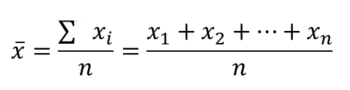
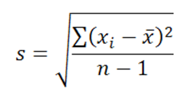
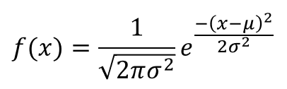
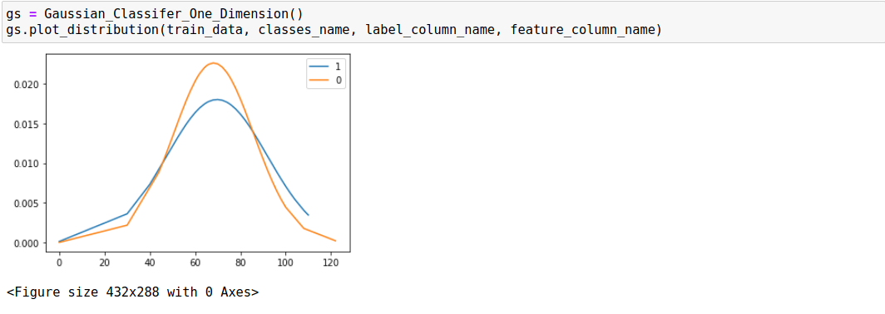
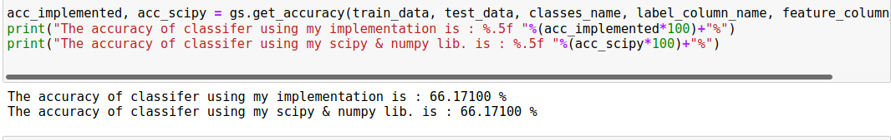
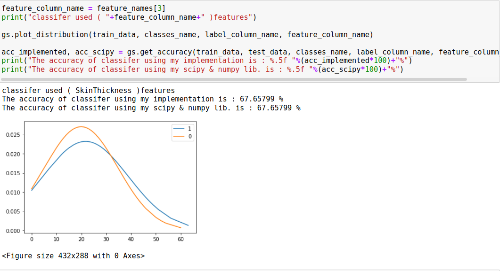
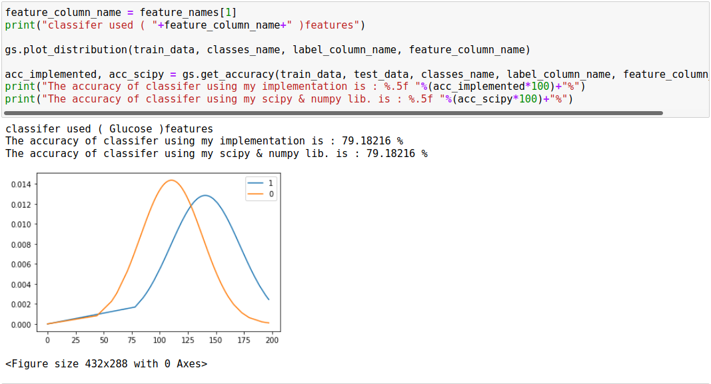

# GaussianClassiferFromScratchOneDimension

# Generative Model Approach

  - It’s simple, and powerful to build classifier.
  - It’s based on probability distribution.
  - It's a categorization of classifiers in Bayesian perspective. 
  - It's a statistical model of the joint probability distribution on P(X|Y)
  - Describes how data is generated, in terms of a probabilistic model.

# Example of generative classifiers:

    1 - naive Bayes classifier. 
    2 - linear discriminant analysis.
    3 - Hidden Markov Models.
  
  
 # The main idea:

    1 – fit the probability for each classes labels separately in our training data.
    2 – fit the probability distribution for each classes labels in our training data.
    3 – predict new point comes with maximize joint probability distribution.(Bayes' Theorem)
    
    
 # How Generative model is classifying data in one dimension ?
 
 	- The Gaussian in one dimension is called Univariate gaussian.
	- It’s specified by just two parameter (mean, standard deviation)
  	- It used Bayes' rule for predicting/classifying new point.
	
	
   # There are many steps for predict labels, And classify data.

# 1. Bayes’ Theorem
	
 
 
 	Which is:
		1. P(A|B) is the posterior probability or the probability of A to occur given event B already occurred.
		2. P(B|A) is the likelihood, or the probability of B given A.
		2. P(A), P(B) is the prior probability of event A and B to occur.
	
	Note :
		The variables are independent and P(B) dosn’t change, So we can removed it.
	
	
# 2. How Gaussian Classifier works ?

	Step One:
	mean: Is the average of the numbers,
		Calculates mean for each classes labels individually.
 
 	
	Step Two: 
	standard deviation: Is a measure of the amount of variation or dispersion of a set of values.
				- Calculates standard deviation for each classes labels individually.
				
 	
 	Where {X1, X2, …. , Xn} are the observed values of the sample items,  is the mean value of these observations, and N is the number of observations in the sample. 
	
	Step Three:
	Fit a gaussian distribution
		Because we are working with continous vairables,
		We are using Probabalility density function instead of using liklihood disscussed above.
		The ( PDF ) is used to specify the probability of the random variable falling within a particular range of values.
		We are using pdf to fit a distribution of training data, 
		And to predict new point comes on calculations of conditional probablilty.
		
 

	The next figure is the fitting gaussian distribution under one features used in classifer.
	
 
 
  	Step Four:
	Predict
	classify new point X pick the class label with highest (prior probability * P(x))
		where P(X): Is the Probability Density Function.
	
	
# Concolusion
	First, I tested classifier with different one dimension features, 
		Then I want to look at the accuracy, and compare it with Bell curve of normal distribution.
		
	For example: 
		In the next figure, the result of accuracy [ I used diabete features called ( 'BloodPressure' ) ] is
 
 
 	And their normal distributions is looks like:
	
 

	Final: we understand that the accuracy isn't good it's ( 61% ), 
		And if you looks at normal distributions the two classes labels dosn't separate well,
		So the accuracy is lower ( 61% ).
		
	Let's take another example:
		The next figure, we looks at the accuracy is heigher than above example [ I used feature called ( 'SkinThickness' ) ],
		Because if we looks at the normal distributions the classes labels might be separate well.
	
 
 
	Let's take a final example:
		The accuracy of the next classifier used feature ( 'Glucose' ) is the best of the two examples above,
		And if we looks at the normal distributions the classes labels separated well, So the accuracy if higher than other.
		
 
 

	
  	At the End
	- Gassian Classifer is good classifer, but isn't good when it used one feature.
	- Gaussian isn't more accurate in one dimension and when variables are independent.
	- Gaussian is easy,and used in many applications like (text classification, spam filtering, and recomender system).
	- Gaussian is good classifer, more accurate, and more efficient, When it uses multi-dimension features,
	   And variables are dependent, Also called [ mulitvariate Gaussian ].

# References
[1] https://towardsdatascience.com/a-generative-approach-to-classification-17a0b5876729
[2] https://en.wikipedia.org/wiki/Bayes%27_theorem
[3] https://en.wikipedia.org/wiki/Generative_model
[4] https://luminousmen.com/post/data-science-bayes-theorem
[5] https://machinelearningmastery.com/joint-marginal-and-conditional-probability-for-machine-learning/
